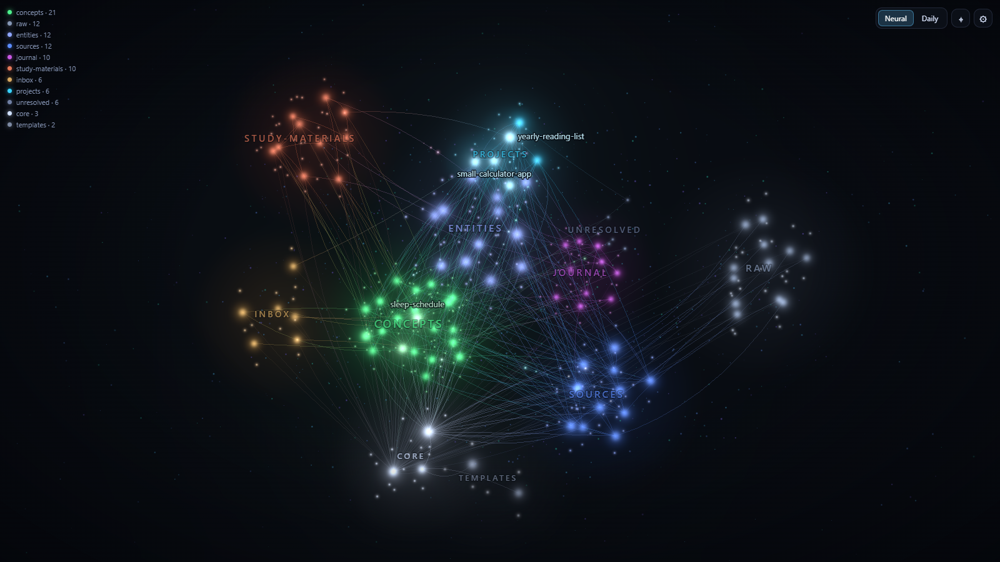
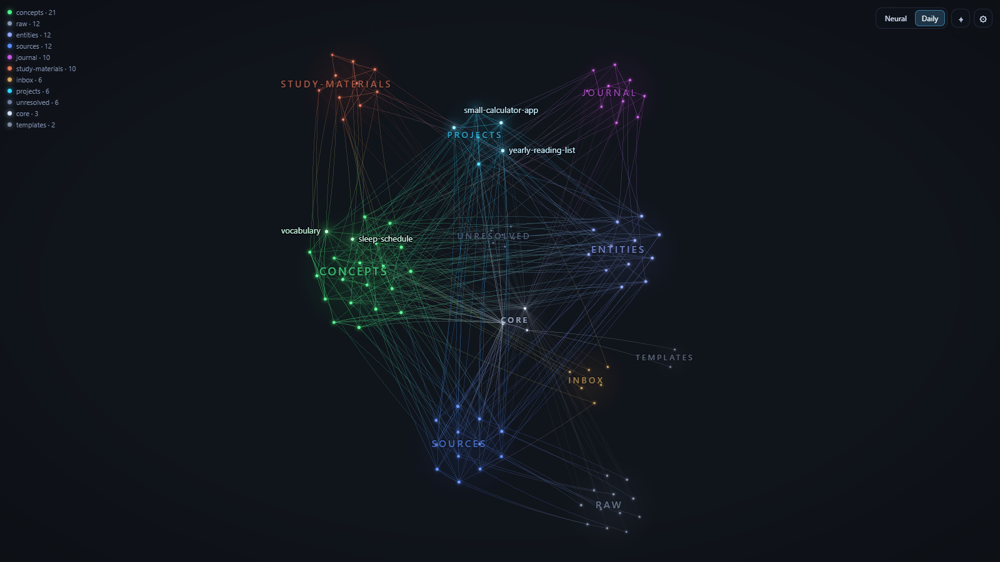
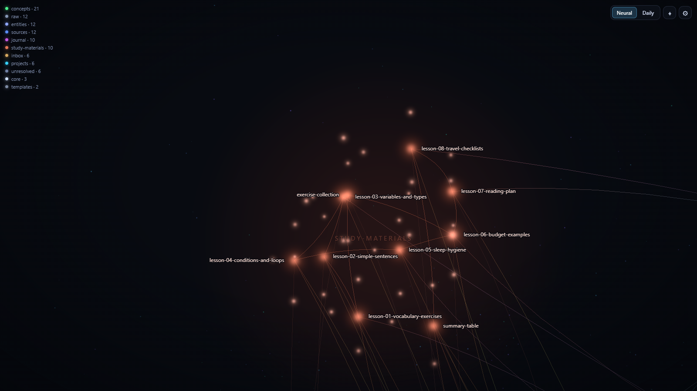

# Neural Brain Kit

> This repo is in English; Claude will talk to you in your own language.

**Turn your notes into a "digital brain."** Claude installs the **Neural Brain** plugin for Obsidian and
organizes your folders with the **Karpathy method**, without deleting or overwriting anything.



> The picture is taken from a synthetic demo wiki: these are nobody's real notes.

## What you get

- **The Neural Brain plugin** for Obsidian: your notes as glowing neurons, links as synapses, pulses and
  semantic zoom. Two modes: the beautiful **Neural** and the flat, readable **Daily**.
  The plugin **only reads** your notes and never changes them.
- **A knowledge base built on the Karpathy method:** `raw/` (your original material), `wiki/` (the pages Claude
  maintains), `inbox/` (quick captures), a schema and a catalog.
- **Six skills for Claude:** `/wiki-ingest`, `/wiki-query`, `/wiki-lint`, `/wiki-capture`, `/wiki-idea`,
  `/wiki-draft` (digest a source, ask the base, check it, capture quickly, develop an idea, write a text).
- **Organizing your own folders.** Claude makes a backup first, then shows a plan and acts only after your
  "yes". Default: **soft adoption**: your old folders are not moved.

## What you need

1. **Obsidian** (free): <https://obsidian.md>
2. **Claude Code** (in a terminal, or in the Code section of the Claude desktop app): <https://claude.com/claude-code>
3. **git** (recommended: updates are then one command). Without git you can download the ZIP, but to
   update you will have to download it again.

## Quick start: 3 steps

**1.** Clone this repo (or download the ZIP and unpack it):

```bash
git clone https://github.com/Gor1x1/neural-brain-kit.git neural-brain-kit
```

**2.** Open Claude **in this folder** (`neural-brain-kit`).

**3.** Type:

```
/setup
```

Claude will ask where your notes are (or whether you don't have any yet), back them up, install the plugin,
suggest an organization, and tell you the few steps you have to click yourself in Obsidian.

## What `/setup` does

1. Finds your vault (or creates a new one).
2. **Backup:** next to the vault, verified file by file. Sets up git insurance (local, not on GitHub).
3. Reads your folders (read-only).
4. Installs Neural Brain into `.obsidian/plugins/` (shows you what it will do first).
5. **Shows you a plan** and organizes according to it after your "yes": adds a schema, a catalog, a log, skills.
   If you already have a `CLAUDE.md`, `index.md` or `log.md`, they are **never overwritten**: the kit's
   files get other names.
6. Checks that nothing was lost and no link broke.
7. Tells you the next steps in Obsidian (turn on the plugin, open the "brain").

Requires **Node 18 or newer** for the helper scripts (backup, checks, plugin install). Without Node, Claude follows
the manual steps in the docs.

## Safety

- **Nothing is deleted:** no file, no folder.
- **The text of your notes is not changed:** at most a small top block may be added at the start of a file
  (with your approval).
- **Backup before anything else,** and rollback with `git` or from the backup.
- **No internet actions with your notes:** nothing is sent anywhere, git is local only.
- **The plugin** does not write notes, it only reads; it writes its own settings files.

Details: [docs/ORGANIZE.md](docs/ORGANIZE.md).

## Examples

| Neural (3D) | Daily (flat) |
|---|---|
|  |  |



## Documentation

| Document | What it covers |
|---|---|
| [docs/METHOD.md](docs/METHOD.md) | the Karpathy method in plain words |
| [docs/ORGANIZE.md](docs/ORGANIZE.md) | how your folders get organized (and what is never done) |
| [docs/PLUGIN.md](docs/PLUGIN.md) | plugin installation, controls, troubleshooting |
| [docs/UPDATE.md](docs/UPDATE.md) | how to update (`/update`) |
| [CLAUDE.md](CLAUDE.md) | instructions for Claude (you don't need them, but you can read them) |

## Repo structure

```
README.md · CLAUDE.md · LICENSE · THIRD-PARTY-NOTICES.md
docs/                  METHOD · ORGANIZE · PLUGIN · UPDATE · img/
plugin/                the ready-made plugin (main.js, manifest.json, styles.css)
vault-template/        schema, index, log, folders, templates, 6 skills
.claude/commands/      /setup · /organize · /update
scripts/               backup-vault · vault-scan · add-frontmatter · install-plugin · kit-state · new-vault
                       (used by Claude), plus demo and test tools for developers
src/ · esbuild.mjs     the plugin's source code
```

## For developers

```bash
npm ci                 # dependencies
npm run build          # build the plugin → plugin/
npm run check          # tsc
npm run demo           # synthetic demo vault + graph export to dev/graph.js
npm run screenshots    # pictures into docs/img/ (with Chrome)
node scripts/make-messy-vault.mjs <folder>   # a "messy" test vault, to try /organize
```

## Credits and license

The method: **Andrej Karpathy**, "LLM Wiki" ([original](https://gist.github.com/karpathy/442a6bf555914893e9891c11519de94f)).
The plugin uses [Three.js](https://threejs.org) and [d3-force-3d](https://github.com/vasturiano/d3-force-3d).
License: MIT, © Gor1x1 ([LICENSE](LICENSE)). Licenses of the bundled libraries:
[THIRD-PARTY-NOTICES.md](THIRD-PARTY-NOTICES.md).
