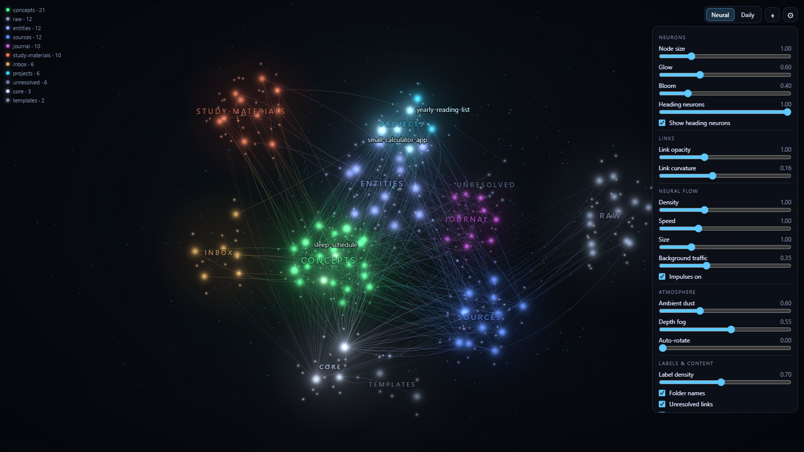

# Neural Brain plugin

**Neural Brain** is an Obsidian plugin that shows your vault as a "digital brain": every note is a small
glowing neuron, links are curved synapses, and headings are tiny neurons around the note.
As you zoom in on a note, you see its name and its neighbours; from far away only the folder names are visible.


> [!info] The pictures are taken from a **synthetic demo vault** (`npm run demo`). These are not your notes.

## Guarantee: read-only

The plugin **does not write, change, or delete notes.** It reads the vault's link map (Obsidian's
`metadataCache`) and draws it in a separate window. It writes only its own files in its own folder:
`data.json` (settings) and `layout-neural.json` / `layout-daily.json` (the saved neuron positions,
so that tomorrow it looks the same). Nothing is sent anywhere over the internet. It works only in
desktop Obsidian, not on mobile.

## Installation

### Automatic (Claude does it during `/setup`)

```bash
node scripts/install-plugin.mjs "<path to the vault>" --dry-run   # first shows what it would do
node scripts/install-plugin.mjs "<path to the vault>"
```

The script copies three files from `plugin/` to `<vault>/.obsidian/plugins/neural-brain/`, **does not touch**
`data.json` and `layout-*.json`, and adds `neural-brain` to `community-plugins.json` (making a backup copy
`community-plugins.json.bak-<time>` first; the other plugins stay). It checks everything **before** it writes,
so a failure leaves the vault untouched.

- It needs **Node 18 or newer** (it says so and stops if yours is older: use the manual install below).
- **`--init`**: for a brand-new vault or a plain folder of notes that was never opened in Obsidian, there is no
  `.obsidian/` folder yet. Without `--init` the script stops and tells you; with `--init` it creates the folder.
- **Quotes in paths.** Put a path with spaces in quotes, and do not end it with a backslash
  (`"C:\My notes\"` makes the shell swallow the closing quote); write `"C:\My notes"`.

### Manual install (if there is no Node)

1. In the vault folder find `.obsidian` (a hidden folder: on Windows "View → Show → Hidden items",
   on macOS `Cmd+Shift+.`). If it does not exist, first open that folder in Obsidian ("Open folder as vault")
   and close Obsidian.
2. Create `.obsidian/plugins/neural-brain/`.
3. Copy this repo's `plugin/main.js`, `plugin/manifest.json`, `plugin/styles.css` into it.
4. Open `.obsidian/community-plugins.json` (create it if it does not exist) and add `"neural-brain"` to the
   list, for example `["neural-brain"]` or `["dataview", "neural-brain"]`. If the file exists, copy it to
   `community-plugins.json.bak` first.

### Enable it in Obsidian (you do this step)

1. Open Obsidian and choose your vault.
2. Settings → **Community plugins**. If it says "Restricted mode", click **Turn on community plugins**.
3. Find **Neural Brain** in the list and turn it on. If Obsidian asks about trust: **Trust author**.
4. If the plugin does not show up, restart Obsidian.

## Open and control

- The **brain icon** in the left panel, or the command (`Ctrl/Cmd+P`) **Open Neural Brain**.
- Commands: **Switch to Neural (3D showcase) mode**, **Switch to Daily (flat, readable) mode**,
  **Re-layout the neural graph**.
- Top right: the **Neural / Daily** switch.
  - **Neural**: three-dimensional, with glow and light pulses; for looking and understanding.
  - **Daily**: flat and readable, folders as islands; for everyday work.


| Action | What it does |
|---|---|
| Left mouse button + drag | rotate (Neural); pan (Daily) |
| Wheel | zoom in / out; note names appear as you zoom in |
| Right mouse button + drag | pan |
| Hover over a note | its neighbours light up, pulses run exactly between them |
| Click a note | the camera flies to the note and a card appears (**Open note** / **Open to the side**) |
| Double-click | open the note in a new tab (`Ctrl/Cmd` + double-click: to the side) |
| ⌖ button | reset the camera |
| ⚙ button | settings panel (see below) |



### The ⚙ panel

Five sections; the settings are stored separately for the Neural and Daily modes.

- **Neurons.** Node size, **Glow**, **Bloom**, Heading neurons (the tiny neurons for a note's headings)
- **Links.** Link opacity, Link curvature
- **Neural flow.** the pulses' Density, Speed, Size, Background traffic
- **Atmosphere.** Ambient dust (background dust), Depth fog, Auto-rotate
- **Labels & content.** Label density, Folder names, Unresolved links, Orphan notes

> [!tip] If the glow is too much for your eyes
> Lower the **Glow** and **Bloom** sliders (at Bloom 0 the glow is switched off completely). The defaults
> are already moderate. If your computer is weak, the plugin lowers the quality by itself and tells you so.

## Settings page (Settings → Neural Brain)

- **Open notes in.** where a note opens on double-click (new tab / to the side / new window)
- **Hidden files.** files that should not appear in the graph (for example `log.md`). The notes are not changed
- **Folder colours.** the colour of each folder: the same folder = the same colour everywhere. Folders not in
  the list get an automatic colour, and with **Add folder rule** you can add your own
- **Re-layout.** the neurons' positions are saved so that the graph always looks the same. Ask for a new
  layout only if you really want one

## How colours and sizes are decided

- **Colour:** from the folder (the family). The method's folders come with ready-made colours
  (`wiki/projects`, `wiki/concepts`, `wiki/sources`, `wiki/entities`, `raw`, `inbox`, `templates`).
- **Size:** the more notes link to a note, the larger its neuron (logarithmic, with a ceiling). "Hub giants"
  like `index.md` (60+ links) are shrunk so they don't drown the graph.
- **Important note:** `pinned: true` or `accent: true` in the top block (or an Obsidian bookmark) → the note
  gets an accent. The six most-linked notes are accented automatically as well.

## Problems

| Problem | Solution |
|---|---|
| The plugin is not in the list | check that the folder is named exactly `neural-brain` and has `manifest.json` inside (`"id": "neural-brain"`); restart Obsidian |
| "Restricted mode" | Settings → Community plugins → **Turn on community plugins** |
| The window is empty/black | Obsidian needs WebGL. Settings → General → turn on "Hardware acceleration" and restart |
| Few neurons in the graph | Obsidian shows only `.md` notes; look at the toggles in the "Labels & content" section (Orphan notes) |
| Too bright | ⚙ → Glow / Bloom low |
| Slow | ⚙ → turn off **Show heading neurons**, lower the Density or the background dust |
| "multiple instances of Three.js" in the console | a harmless warning if you have another 3D-graph plugin |
| The graph does not refresh after a new note | wait a few seconds; if that does not help, close and reopen the Neural Brain tab |

## Remove the plugin

1. Obsidian → Settings → Community plugins → turn off **Neural Brain**.
2. Close Obsidian. **You** delete the `.obsidian/plugins/neural-brain/` folder yourself (Claude never deletes
   anything; if you would rather not delete it, drag it out of `.obsidian/plugins/` to somewhere else) and remove
   `"neural-brain"` from `.obsidian/community-plugins.json` (Claude can do that edit for you after a `.bak` copy).
   Your notes have not changed, so there is nothing to restore.

## Technical

The code: TypeScript, Three.js + d3-force-3d, built with esbuild (`npm ci && npm run build`). See `src/`.
Creating the demo vault and the pictures: `npm run demo`, `npm run screenshots` (with Chrome, headless).
Licenses of the bundled libraries: [THIRD-PARTY-NOTICES.md](../THIRD-PARTY-NOTICES.md).
